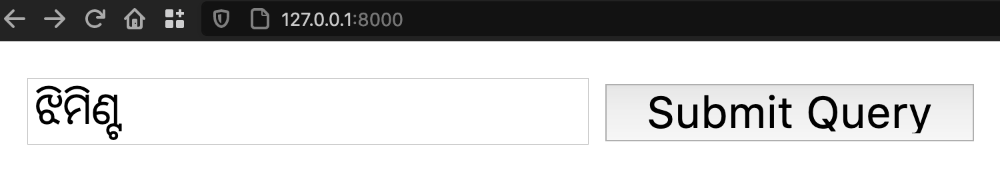
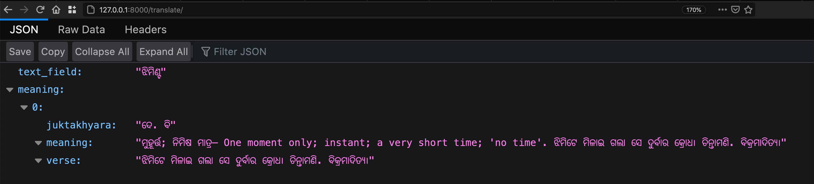

<h2 align="center">Odia Dictionary</h2>

This project scrapes data from https://dsal.uchicago.edu/dictionaries/praharaj/  

- [x] This project scrapes the dictionary corpus data from Purnachandra Bhashakosha  
- [ ] Prepares the mapping between different languages
- [ ] Saves the words
- [ ] Exposes an API for further development by interested 

## Setup
Will be added soon...
## Usage
After installing and running the project
1. Go to http://127.0.0.1:8000/
2. Type in the word you want to search and click on `Submit` button.  

3. You will be able to see the result if the word is present else, mismatch message will come.   

## License
MIT License 

## Contributors ✨

Thanks goes to these wonderful people ([emoji key](https://allcontributors.org/docs/en/emoji-key)):

<!-- ALL-CONTRIBUTORS-LIST:START - Do not remove or modify this section -->
<!-- prettier-ignore-start -->
<!-- markdownlint-disable -->
<table>
  <tr>
    <td align="center"><a href="https://www.linkedin.com/in/soumendrakumarsahoo/"> <b>Soumendra kumar sahoo</b></a> <a href="https://github.com/OdiaNLP/dictionary/commits?author=soumendrak" title="Code">💻</a> <a href="#content-soumendrak" title="Content">🖋</a> <a href="#design-soumendrak" title="Design">🎨</a></td>
  </tr>
</table>

<!-- markdownlint-enable -->
<!-- prettier-ignore-end -->
<!-- ALL-CONTRIBUTORS-LIST:END -->

This project follows the [all-contributors](https://github.com/all-contributors/all-contributors) specification. Contributions of any kind welcome!
